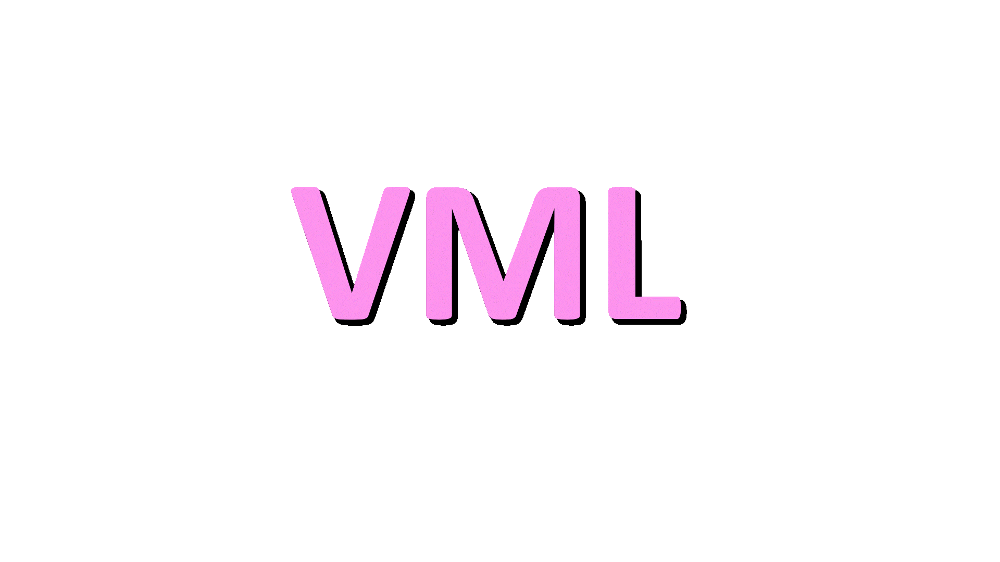

<h1 align='center'>VML-VOLVET MATHS LIBRARY</h1>
The motive of this project is to provide scientific maths operations library in "C" language like NUMPY in python.This project isn't open-source this project may subject to copyright.This is developed by VOLVET INDIA all rights and tradmarks is reserved. 
<h5>Maths + coding which can drive you into the future.</h5>

<h3>About Progress of project:-</h3>
<input type="checkbox" checked> Linux tested done 
<input type="checkbox" checked> First init done

This is only first init of this project.All features are coming soon and also this is only tested on linux only
